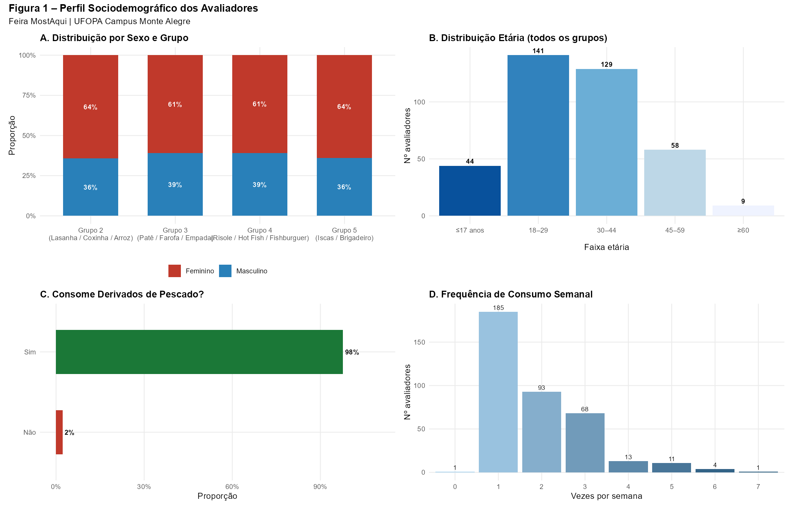
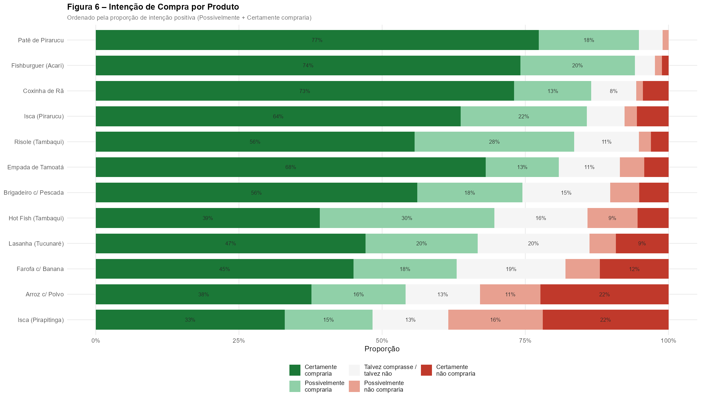
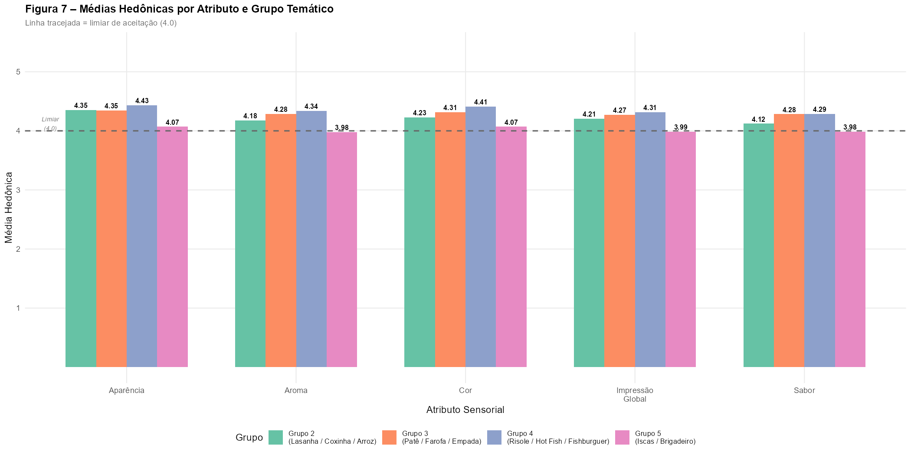
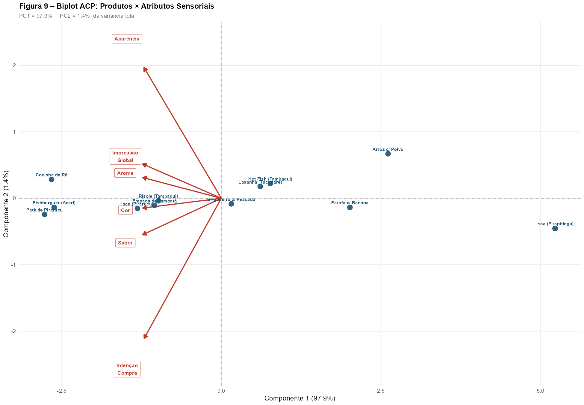
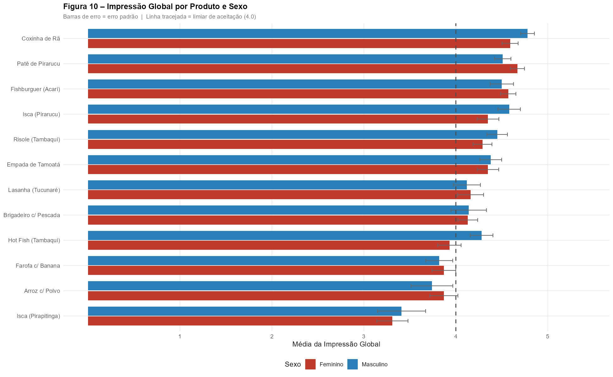

# 🐟 Análise Sensorial Hedônica – Projeto MostrAqui

**Produtos Derivados do Pescado | UFOPA – Campus Monte Alegre**

> Relatório produzido por **Dr. Carlos Antônio Zarzar** — 28 de maio de 2026

---

## 📋 Sobre o Projeto

Este repositório contém o relatório de análise sensorial hedônica realizado no âmbito da **Feira MostrAqui**, evento voltado à avaliação e divulgação de produtos derivados de pescado produzidos na região amazônica, com apoio da Universidade Federal do Oeste do Pará (UFOPA), Campus Monte Alegre.

O objetivo central foi avaliar a **aceitação sensorial e a intenção de compra** de 12 produtos à base de espécies regionais (tucunaré, tambaqui, pirarucu, rã, polvo, entre outras), com base nas percepções de um painel de consumidores potenciais.

---

## 📊 Dados do Estudo

| Item | Valor |
|---|---|
| Avaliações totais | 1.154 |
| Avaliadores únicos | 394 |
| Produtos avaliados | 12 |
| Grupos temáticos | 4 |
| Data do evento | Maio de 2026 |

### Escala Hedônica Utilizada

Escala de 5 pontos:

`1` Desgostei Muito · `2` Desgostei · `3` Nem Gostei/Nem Desgostei · `4` Gostei · `5` Gostei Muito

**Limiar de aceitabilidade:** Índice de Aceitabilidade (IA%) ≥ 70%, calculado com base nas notas ≥ 4.

---

## 🍽️ Produtos Avaliados

Os produtos foram organizados em 4 grupos temáticos:

- **Grupo 2** — Lasanha de Tucunaré · Coxinha de Rã com Creme de Queijo Regional · Arroz Paraense com Polvo
- **Grupo 3** — Patê de Pirarucu · Farofa de Tambaqui com Banana · Empada de Tamoatá com Creme de Queijo Regional
- **Grupo 4** — Risole de Tambaqui · Hot Fish de Tambaqui · Fishburguer de Acari
- **Grupo 5** — Isca de Pirapitinga com Doce de Castanha de Caju e Mel · Isca de Pirarucu com Geleia de Cupuaçu Picante · Brigadeiro de Coco com Pescada

---

## 👥 Perfil dos Avaliadores

- Predominância do público **feminino** (≈ 61–64% em todos os grupos)
- Faixa etária concentrada em **adultos jovens** (mediana entre 26–32 anos; DP ≈ 13 anos)
- **≥ 94,9%** dos avaliadores relataram consumo habitual de derivados de pescado
- Perfil representativo do público-alvo da Feira MostrAqui



---

## 🧪 Estrutura do Relatório

O documento HTML gerado pelo **R Markdown** cobre as seguintes seções:

1. **Pacotes e Configuração** — dependências R utilizadas na pipeline analítica
2. **Leitura e Limpeza dos Dados** — importação do arquivo `df_mostraqui.xlsx`, padronização e engenharia de variáveis
   - 2.1 Qualidade dos Dados (missings, resumo geral)
3. **Perfil dos Avaliadores** — distribuição por sexo, idade e hábitos de consumo
4. **Estatísticas Descritivas dos Atributos** — cor, aroma, aparência, sabor, impressão global e intenção de compra
5. **Índice de Aceitabilidade (IA%)** — por produto e por atributo
6. **Testes Estatísticos** — testes não-paramétricos (rstatix)
7. **Regressão Ordinal** — modelagem da intenção de compra (MASS::polr)
8. **Análise de Correlação** — matriz de correlação entre atributos (corrplot)
9. **Análise de Componentes Principais (ACP)** — biplot produtos × atributos sensoriais
10. **Figuras e Visualizações** — gráficos de barras, boxplots, biplots, análise por sexo e faixa etária
11. **Resumo Conclusivo** — síntese dos resultados e recomendações

---

## 🏆 Principais Resultados

- **91,7% dos produtos** atingiram o limiar de aceitabilidade (IA% ≥ 70%)
- Médias hedônicas **acima de 4,0** na maioria dos produtos avaliados
- **Destaques em aceitação e intenção de compra:** Patê de Pirarucu, Coxinha de Rã e Fishburguer de Acari — com prontidão para escalonamento comercial
- **Produto a revisar:** Isca de Pirapitinga — deve ter seu perfil de sabor reformulado antes de nova avaliação
- Análise de componentes principais revelou **forte dimensão latente única de aceitação global**, com alta correlação entre os atributos sensoriais

### Intenção de Compra por Produto


### Desempenho por Grupos e Atributos


### Biplot ACP — Produtos × Atributos Sensoriais


### Impressão Global por Sexo


---

## 🗂️ Arquivos do Repositório

```
.
├── analise_sensorial_mostaqui_2.html      # Relatório completo (R Markdown renderizado)
├── df_mostraqui.xlsx                      # Base de dados das avaliações sensoriais
├── Figura/
│   ├── fig1_perfil_avaliadores.png
│   ├── fig6_intencao_compra.png
│   ├── fig7_grupos_atributos.png
│   ├── fig9_biplot_acp.png
│   └── fig10_impressao_por_sexo.png
└── README.md
```

> **Nota:** O arquivo `df_mostraqui.xlsx` deve estar presente no diretório de trabalho para reprodução integral das análises.

---

## ⚙️ Reprodução das Análises

O relatório foi produzido em **R** com o framework **R Markdown**. Para reproduzir:

1. Instale os pacotes necessários:

```r
install.packages(c(
  "readxl", "dplyr", "tidyr", "ggplot2", "scales",
  "ggpubr", "rstatix", "corrplot", "RColorBrewer",
  "patchwork", "psych", "MASS", "tibble", "stringr"
))
```

2. Certifique-se de que o arquivo `df_mostraqui.xlsx` esteja no diretório de trabalho.

3. Renderize o arquivo `.Rmd` com `rmarkdown::render()` ou pelo RStudio.

### Por que esses pacotes?

| Pacote | Função |
|---|---|
| `readxl` | Leitura dos dados do Excel |
| `dplyr` / `tidyr` | Limpeza e transformação dos dados |
| `ggplot2` + `ggpubr` + `patchwork` | Geração das figuras |
| `rstatix` | Testes não-paramétricos (tidy) |
| `psych` | Estatísticas descritivas ampliadas |
| `MASS` | Regressão ordinal (`polr()`) |
| `corrplot` | Visualização de correlações |

---

## 📄 Licença

Documento elaborado para fins acadêmicos e científicos no contexto da **UFOPA – Campus Monte Alegre**. Para uso ou reprodução, cite o autor original.

---

*Relatório elaborado em R / R Markdown por **Dr. Carlos Antônio Zarzar**.*
